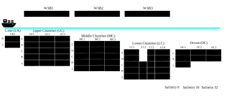

```{r setup, include=FALSE}
knitr::opts_chunk$set(echo = TRUE)
```

## Data Driven Visualization

This project is a test project for building a data driven SVG info graphic using CSS and R. Data is supplied for the Panama Canal Locks with readings including salinity, tempreature, and pressure. Here is a general overview of the instruments located throughout the lock:


Each green circle represents a station with instruments A-E located at that station. Not all stations have all instruments A-E, and this SVG cross section view represents the distribution of instruments:


The intent of data collection and visualization is to track salinity throughout the locking cycle. This will hopefully limit salinity exposure to the freshwater lake. Water is stored in basins adjacent to the locks and pulled from various levels depending on the salinity composition. A cross section looking perpendicular to the lock walls looks as follows:


The supplied data set is for one day of lockages (5 boats). That file alone contains 2269 readings for each instrument (60 instruments). The data was cleaned and supplied to us.

# Creating a visualization

The workflow to create a visualization given an SVG file is as follows:

1. Data (salinity, temperature, salinity) is be supplied from all sensors at the lock.

2. The SVG blocked cross section view of instruments was created using InkScape software. Each instrument block was assigned an instrument name to align with the name in the data set. For example, instrument C at station MC1 is assigned the INS_VALUE MC1_C for both the data set and the SVG shape id.

3. R will read in the data set and the SVG image using the package minisvg.

4. We will iterate through the data and assign color values for each block of salinity ranges (1-2, 2-3, etc.) using the package colorscape. 

5. We will iterate through the entire dataset and create keyframe animation declarations to animate each instrument block. QA checks were conducted to ensure animations ran concurrently. Any readings that do not have data for a particular reading time were colored black.

6. Those animation rules (written in CSS) were then injected into the SVG definition using the minicss package. The SVG can be opened and the visualization viewed in any web browser.

# Salinity Visualizations

Blue represents a low salinity value and red is a high salinity value. Black represents no data present for the current time step. 

The animation lasts 60 total seconds and all animations run concurrently. Each color represent a range of 1 salinity value, grouped 0-1, 1-2, 2-3, etc.

## Continued Work
The visuals below are still under development and QA checks. The following list are items to still be completed


1. Incorporate the temperature and pressure readings into the visual -- possibly their own color coded visuals

2. Create a better graphically designed layout

3. Correctly incorporate dual lockages. Currently, they are shown only as a single moving boat

## Guthorm Maersk (Salinity)
 

## Diamond Gas Rose (Salinity)
 

## CMA CGM Aquila (Salinity)
 

## Ever Lotus (Salinity)
 

## CMA CGM Nabucco (Salinity)
 

